# Lab7Web
<p>Nama : Sayyid Sulthan Abyan</p>
<p>MIN : 312410496</p>
<p>Kelas : TI.24.A.5</p>

---

# Langkah-langkah praktikum

## Membuat Folder dan File Dasar

Buat folder baru di direktori htdocs:

`C:\xampp\htdocs\lab7_php_dasar`

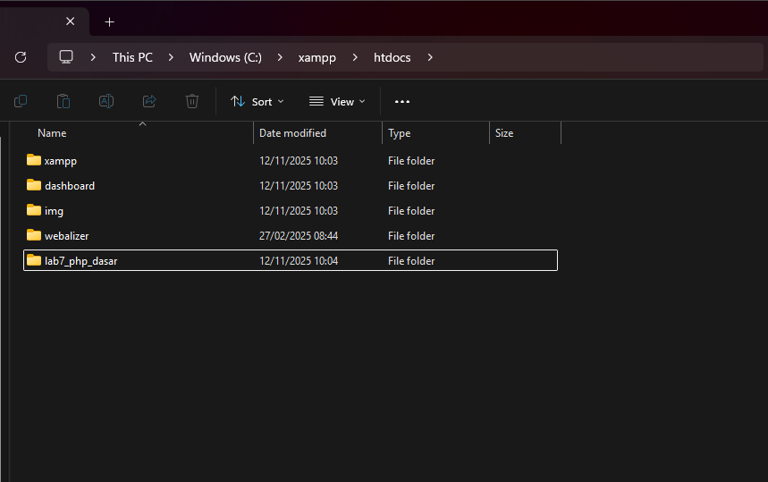

---

## nyalakan web server 

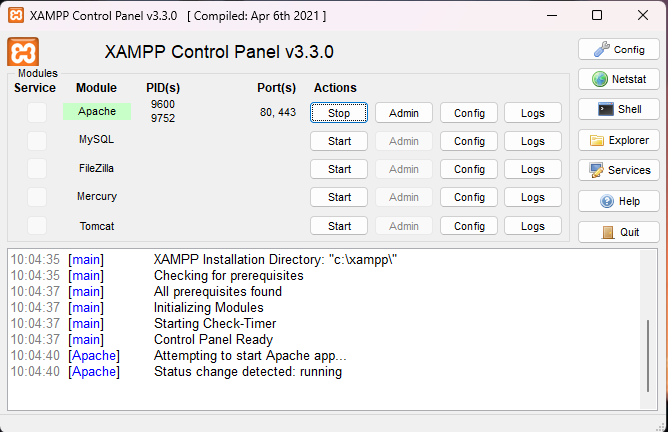

---

## lalu untuk mengakses direktory tersebut gunakan URL:
`http://localhost/lab7_php_dasar`

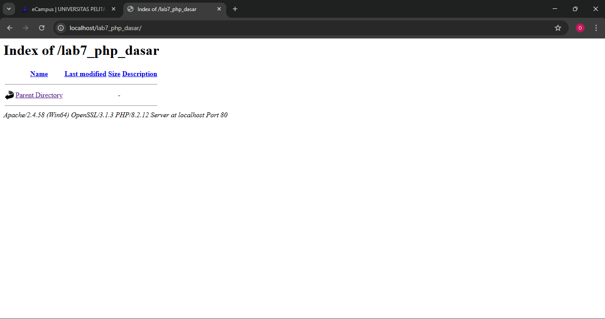

---

## Lalu buat file pertama:

`belajar_php_dasar.php`

``` html
<!DOCTYPE html>
<html>
<head>
    <meta charset="UTF-8">
    <title>PHP Dasar</title>
</head>
<body>
    <h1>Belajar PHP Dasar</h1>
    <?php
        echo "Hello World";
    ?>
</body>
</html>
```

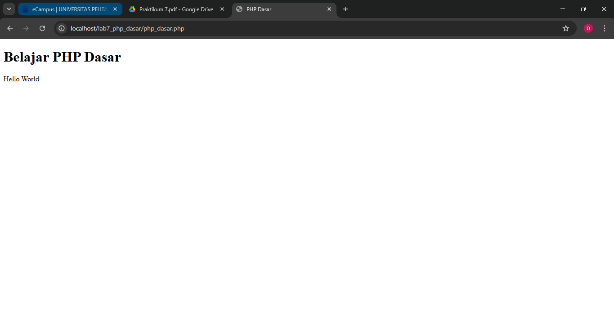

---

## Variabel PHP

Menambahkan variabel $nim dan $nama.

```html
<?php
$nim = "0411500400";
$nama = 'Abdullah';
echo "NIM : " . $nim . "<br>";
echo "Nama : $nama";
?>
```
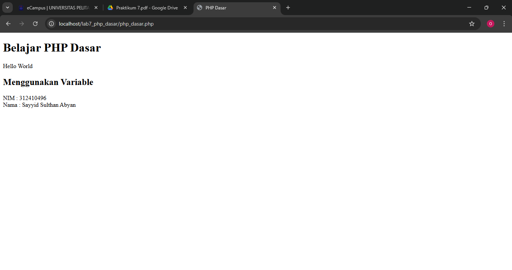

---

## Predefine Variable $_GET

Gunakan `$_GET` untuk menangkap data dari URL:

```html
<?php
echo 'Selamat Datang ' . $_GET['nama'];
?>
```


Akses melalui:

http://localhost/lab7_php_dasar/php_dasar.php?nama=sayyid


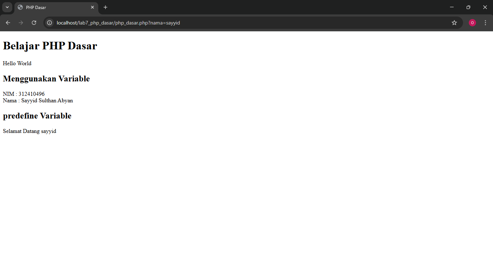

---

## Form Input

Contoh form dengan metode POST:

```html
<form method="post">
    <label>Nama: </label>
    <input type="text" name="nama">
    <input type="submit" value="Kirim">
</form>

<?php
echo 'Selamat Datang ' . $_POST['nama'];
?>
```

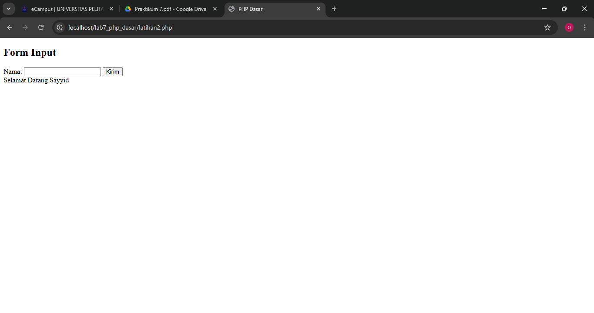

---

## Operator dan Kondisi

Contoh perhitungan sederhana:
```html
<?php
$gaji = 1000000;
$pajak = 0.1;
$thp = $gaji - ($gaji*$pajak);
echo "Gaji sebelum pajak = Rp. $gaji <br>";
echo "Gaji yang dibawa pulang = Rp. $thp"
?>
```

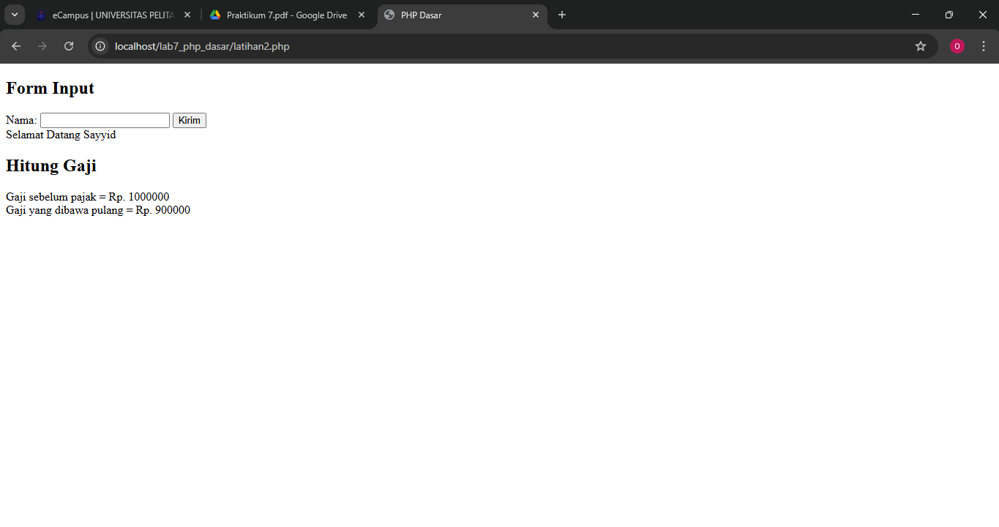

---

## Struktur Kondisi IF

Contoh kondisi hari:
```html
<?php
$nama_hari = date("l");
if ($nama_hari == "Sunday") {
    echo "Minggu";
} elseif ($nama_hari == "Monday") {
    echo "Senin";
} else {
    echo "Selasa";
}
?>
```

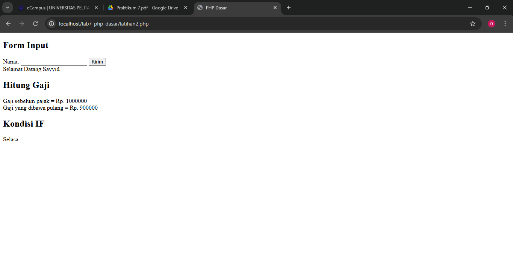

---

## Struktur Kondisi Swicth

Contoh kondisi hari:
```html
<?php
        $nama_hari = date("l");
        switch ($nama_hari) {
        case "Sunday":
        echo "Minggu";
        break;
        case "Monday":
        echo "Senin";
        break;
        case "Tuesday":
        echo "Selasa";
        break;
        default:
        echo "Sabtu";
        }
?>
```
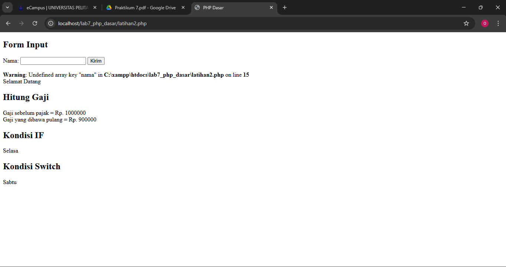

---

## Perulangan for

Contoh:
```html 
<?php
        echo "Perulangan 1 sampai 10 <br />";
        for ($i=1; $i<=10; $i++) {
        echo "Perulangan ke: " . $i . '<br />';
        }
        echo "Perulangan Menurun dari 10 ke 1 <br />";
        for ($i=10; $i>=1; $i--) {
        echo "Perulangan ke: " . $i . '<br />';
        }
?>
```


---

## Perulangan while

Contoh:
```html
<?php
        echo "Perulangan 1 sampai 10 <br />";
        $i=1;
        while ($i<=10) {
        echo "Perulangan ke: " . $i . '<br />';
        $i++;
        }
?>
```
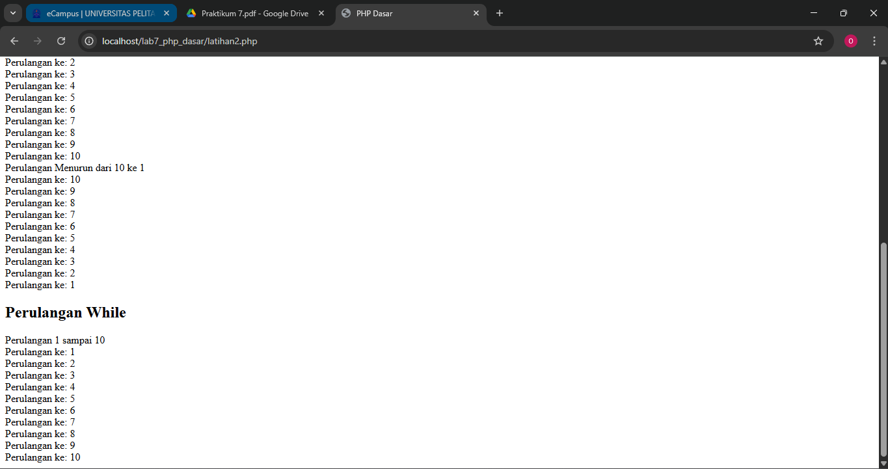

---

## Perulangan dowhile

Contoh:
```html
<?php
        echo "Perulangan 1 sampai 10 <br />";
        $i=1;
        do {
        echo "Perulangan ke: " . $i . '<br />';
        $i++;
        } while ($i<=10);
?>
```
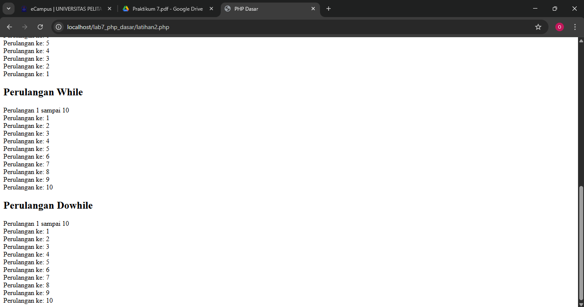

---

# Tugas Praktikum

Soal:

**Buat program PHP sederhana dengan form input yang menampilkan nama, tanggal lahir, dan pekerjaan.
Hitung umur berdasarkan tanggal lahir, serta tampilkan gaji sesuai pekerjaan yang dipilih.**

```html
<!DOCTYPE html>
<html lang="id">
<head>
  <meta charset="UTF-8">
  <meta name="viewport" content="width=device-width, initial-scale=1.0">
  <title>Form Input Data</title>
  <style>
    body {
      font-family: Arial, sans-serif;
      background-color: #f5f5f5;
      padding: 30px;
    }
    h2 {
      text-align: center;
      color: #333;
    }
    form {
      background: #fff;
      padding: 20px;
      border-radius: 10px;
      box-shadow: 0 0 10px rgba(0,0,0,0.1);
      width: 400px;
      margin: 0 auto;
    }
    label {
      display: block;
      margin-top: 10px;
      font-weight: bold;
    }
    input, select {
      width: 100%;
      padding: 8px;
      margin-top: 5px;
      border-radius: 5px;
      border: 1px solid #ccc;
    }
    input[type="submit"] {
      background-color: #007bff;
      color: white;
      cursor: pointer;
      border: none;
      margin-top: 15px;
    }
    .result {
      background: #fff;
      padding: 20px;
      border-radius: 10px;
      width: 400px;
      margin: 20px auto;
      box-shadow: 0 0 10px rgba(0,0,0,0.1);
    }
  </style>
</head>
<body>

  <h2>Form Input Data</h2>

  <form method="POST" action="">
    <label>Nama:</label>
    <input type="text" name="nama" required>

    <label>Tanggal Lahir:</label>
    <input type="date" name="tgl_lahir" required>

    <label>Pekerjaan:</label>
    <select name="pekerjaan" required>
      <option value="">-- Pilih Pekerjaan --</option>
      <option value="Programmer">Programmer</option>
      <option value="Desainer">Desainer</option>
      <option value="Guru">Guru</option>
      <option value="Dokter">Dokter</option>
      <option value="Petani">Petani</option>
    </select>

    <input type="submit" name="submit" value="Tampilkan">
  </form>

  <?php
  if (isset($_POST['submit'])) {
    $nama = $_POST['nama'];
    $tgl_lahir = $_POST['tgl_lahir'];
    $pekerjaan = $_POST['pekerjaan'];

    $tgl_lahir_obj = new DateTime($tgl_lahir);
    $sekarang = new DateTime();
    $umur = $sekarang->diff($tgl_lahir_obj)->y;

    switch ($pekerjaan) {
      case 'Programmer':
        $gaji = 8000000;
        break;
      case 'Desainer':
        $gaji = 6000000;
        break;
      case 'Guru':
        $gaji = 5000000;
        break;
      case 'Dokter':
        $gaji = 10000000;
        break;
      case 'Petani':
        $gaji = 4000000;
        break;
      default:
        $gaji = 0;
        break;
    }

    echo "<div class='result'>";
    echo "<h3>Hasil Data</h3>";
    echo "Nama: <strong>$nama</strong><br>";
    echo "Tanggal Lahir: <strong>" . date('d-m-Y', strtotime($tgl_lahir)) . "</strong><br>";
    echo "Umur: <strong>$umur tahun</strong><br>";
    echo "Pekerjaan: <strong>$pekerjaan</strong><br>";
    echo "Gaji: <strong>Rp " . number_format($gaji, 0, ',', '.') . "</strong>";
    echo "</div>";
  }
  ?>

</body>
</html>
```

## Hasil Output

Contoh hasil setelah form dikirim:

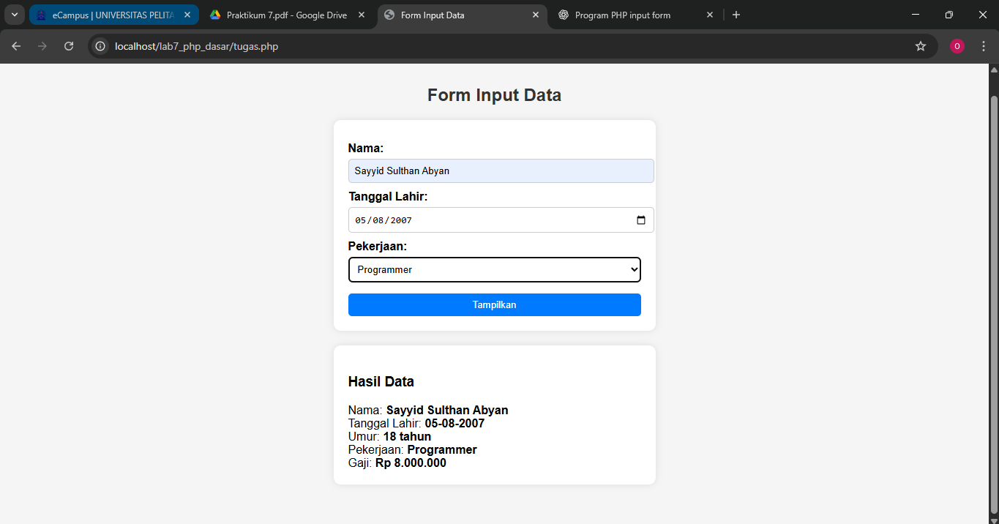
